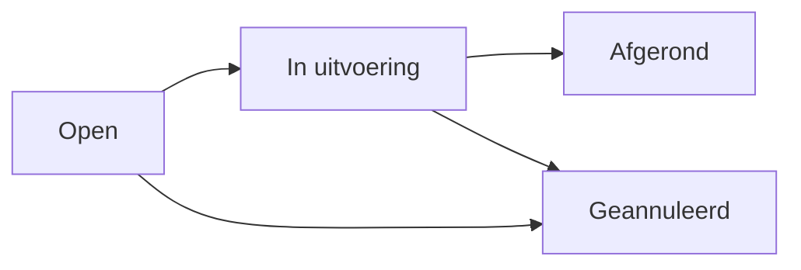
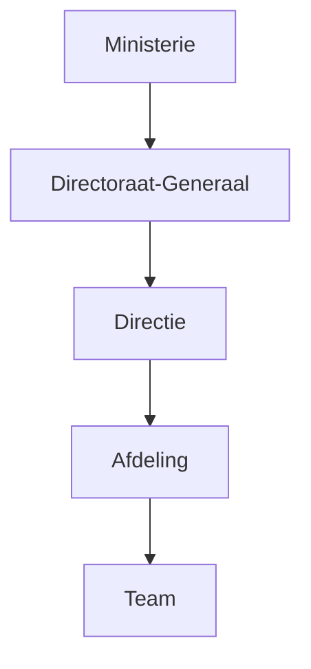
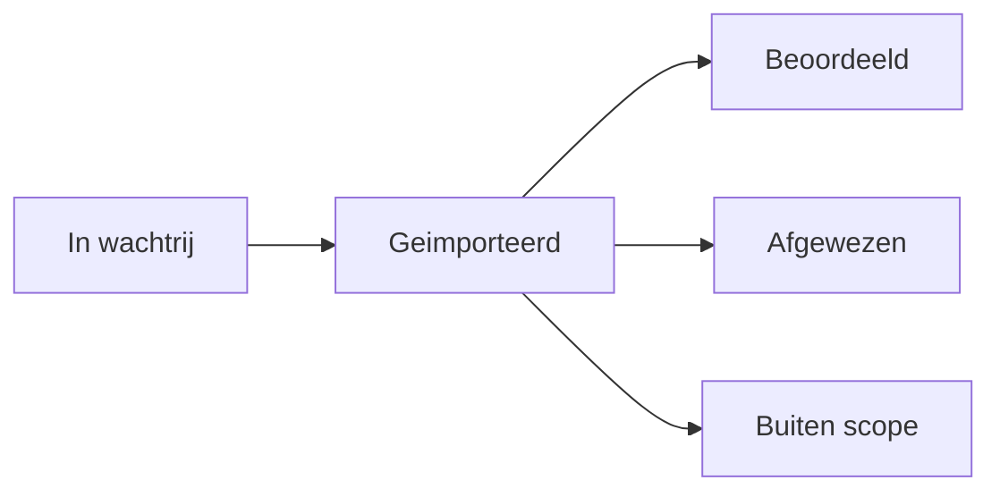

# Functionele handleiding

Deze handleiding beschrijft hoe Bouwmeester werkt vanuit het perspectief van de gebruiker.

## Modules

Bouwmeester bestaat uit de volgende hoofdmodules:

| Module | Beschrijving |
|---|---|
| **Inbox** | Persoonlijke meldingen, toewijzingen en berichten |
| **Corpus** | De beleidsgrafiek: nodes, relaties en visualisatie |
| **Taken** | Taakbeheer gekoppeld aan beleidsnodes |
| **Organisatie** | Organisatiestructuur en personeelsbeheer |
| **Kamerstukken** | Import en beoordeling van parlementaire items |
| **Zoeken** | Zoeken over alle entiteiten |
| **Auditlog** | Overzicht van alle wijzigingen |
| **Beheer** | Administratieve instellingen en toegangsbeheer |

## Corpus (Beleidsgrafiek)

Het corpus is de kern van Bouwmeester: een gerichte graaf van beleidsnodes en hun relaties.

### Nodes aanmaken

1. Klik op **Toevoegen** in het corpus-overzicht
2. Kies een node type (Dossier, Doel, Instrument, etc.)
3. Vul de titel en beschrijving in
4. Stel de status in (standaard: Actief)
5. Voeg eventueel tags toe voor categorisering

### Relaties leggen

1. Open een node in de detailweergave
2. Klik op **Relatie toevoegen**
3. Kies het relatietype (bijv. "Draagt bij aan", "Implementeert")
4. Selecteer de doelnode
5. Voeg optioneel een beschrijving toe

### Grafiekweergave

De grafiekweergave toont nodes als gekleurde blokken en relaties als pijlen. Elke kleur correspondeert met een node type:

- Blauw = Dossier
- Groen = Doel
- Paars = Instrument
- Rood = Probleem
- Cyaan = Maatregel

Je kunt inzoomen op een specifieke node om de directe buren te zien, of de diepte vergroten om een breder netwerk te bekijken.

### Tags

Tags zijn hiërarchische labels die aan nodes gekoppeld kunnen worden. Ze helpen bij het categoriseren en filteren van het corpus. Tags kunnen subtags hebben voor fijnmazige classificatie.

## Stakeholders

Personen kunnen als betrokkene aan nodes gekoppeld worden met een van drie rollen:

| Rol | Beschrijving |
|---|---|
| **Eigenaar** | Verantwoordelijk voor de node |
| **Betrokken** | Actief betrokken bij het beleidsveld |
| **Adviseur** | Adviseert over het beleidsveld |

Stakeholders ontvangen meldingen wanneer hun nodes worden gewijzigd.

## Taken

Taken zijn actiepunten die aan beleidsnodes gekoppeld zijn.

### Taak aanmaken

1. Open een node in de detailweergave
2. Klik op **Taak toevoegen**
3. Vul titel en beschrijving in
4. Kies prioriteit: Kritiek, Hoog, Normaal of Laag
5. Wijs een verantwoordelijke toe
6. Stel eventueel een deadline in

### Taakstatussen

- **Open** - Taak is aangemaakt maar nog niet opgepakt
- **In uitvoering** - Er wordt actief aan gewerkt
- **Afgerond** - Taak is voltooid
- **Geannuleerd** - Taak is niet meer relevant

### Subtaken

Taken kunnen subtaken bevatten voor het opsplitsen van complexe werkzaamheden. Subtaken erven de koppeling met de bovenliggende node.

## Organisatie

De organisatiemodule beheert de structuur van de organisatie.

### Hiërarchie

De organisatiestructuur volgt de standaard rijksoverheidsindeling:

Elk niveau kan een **manager** hebben en bevat **personen** die daar geplaatst zijn.

### Personen

Personen kunnen medewerkers of **agents** (geautomatiseerde systemen) zijn. Elke persoon heeft:

- Naam en contactgegevens
- Functie
- Plaatsing bij een organisatie-eenheid
- Dienstverband (in dienst, ingehuurd, extern)

## Kamerstukken

De Kamerstukken-module importeert parlementaire items en koppelt ze aan het beleidscorpus.

### Soorten parlementaire items

| Type | Beschrijving |
|---|---|
| Motie | Verzoek van de Kamer aan de regering |
| Kamervraag | Schriftelijke vraag aan een minister |
| Toezegging | Belofte van een minister aan de Kamer |
| Amendement | Wijzigingsvoorstel op een wetsvoorstel |
| Commissiedebat | Debat in een Kamercommissie |
| Schriftelijk Overleg | Schriftelijke gedachtewisseling met de Kamer |

### Beoordelingsproces

1. Items worden automatisch geïmporteerd en krijgen status **In wachtrij**
2. Het systeem stelt relaties voor met bestaande corpus nodes (**suggested edges**)
3. Een beoordelaar bekijkt elk item en de voorgestelde relaties
4. Per relatie: **goedkeuren** (edge wordt aangemaakt) of **afwijzen**
5. Het item krijgt status **Beoordeeld**, **Afgewezen** of **Buiten scope**

## Inbox

De inbox toont persoonlijke meldingen:

- Taaktoewijzingen en deadlines
- Wijzigingen aan nodes waarvan je stakeholder bent
- Nieuwe parlementaire items
- Directe berichten en vermeldingen
- Verzoeken tot vervanging bij afwezigheid

Meldingen kunnen als gelezen worden gemarkeerd.

## Zoeken

De zoekfunctie doorzoekt alle entiteiten: nodes, taken, personen, organisatie-eenheden, parlementaire items en tags. Resultaten tonen het type, een highlight van de match, en een directe link.

Sneltoets: druk op `/` om direct te zoeken.

## Auditlog

Elke wijziging in Bouwmeester wordt vastgelegd in het auditlog. Het log toont:

- Wie de wijziging heeft gedaan
- Wat er is gewijzigd
- Wanneer de wijziging plaatsvond

Het auditlog is filterbaar op type (nodes, taken, relaties, personen, organisatie, etc.).
