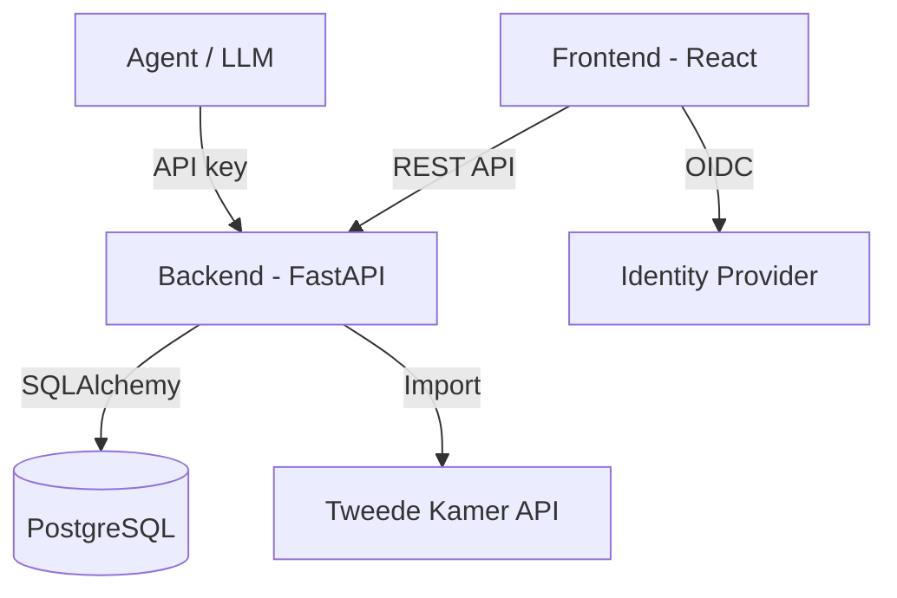
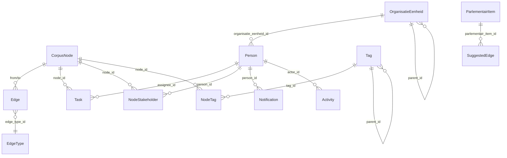

# Technische documentatie

## Architectuur

Bouwmeester is opgebouwd uit drie hoofdcomponenten:

| Component | Technologie | Beschrijving |
|---|---|---|
| **Backend** | FastAPI + SQLAlchemy 2.0 + Alembic | REST API met async PostgreSQL |
| **Frontend** | React + TypeScript + React Query + Tailwind CSS | Single-page applicatie |
| **Database** | PostgreSQL 16 | Relationele database met UUID primary keys |

## API-documentatie

De volledige API is gedocumenteerd via OpenAPI:

- **Swagger UI**: [`/api/docs`](/api/docs) - Interactieve API-documentatie
- **ReDoc**: [`/api/redoc`](/api/redoc) - Alternatieve documentatie
- **Agent Skill Guide**: [`/api/skill.md`](/api/skill.md) - Markdown-handleiding voor agent-consumptie
- **OpenAPI spec**: `/api/openapi.json` - Machine-leesbare specificatie

## Authenticatie

Bouwmeester ondersteunt twee authenticatiemethoden:

### OIDC (voor gebruikers)

In productie wordt OpenID Connect gebruikt voor authenticatie. Gebruikers loggen in via de Identity Provider van de organisatie.

### API keys (voor agents)

Geautomatiseerde systemen (agents) authenticeren met een API key:

- Keys beginnen met het prefix `bm_`
- Keys worden aangemaakt bij het aanmaken van een agent-persoon
- Verstuur de key in de `Authorization` header: `Authorization: Bearer bm_...`
- Keys kunnen geroteerd worden via de admin-interface

### Toegangslijst

Toegang is beperkt tot e-mailadressen op de toegangslijst (whitelist). Beheerders kunnen de lijst aanpassen via **Beheer > Toegangslijst**. Nieuwe gebruikers kunnen toegang aanvragen.

## Datamodel

### Entiteitsrelaties

### Node types

| Type | API waarde | Beschrijving |
|---|---|---|
| Dossier | `dossier` | Beleidsdossier |
| Doel | `doel` | Beleidsdoel |
| Instrument | `instrument` | Beleidsinstrument |
| Beleidskader | `beleidskader` | Juridisch/beleidsmatig kader |
| Maatregel | `maatregel` | Concrete uitvoeringsmaatregel |
| Probleem | `probleem` | Maatschappelijk probleem |
| Effect | `effect` | Verwacht of gemeten effect |
| Beleidsoptie | `beleidsoptie` | Mogelijke aanpak |
| Politieke Input | `politieke_input` | Parlementair item |
| Bron | `bron` | Brondocument |
| Notitie | `notitie` | Vrije notitie |
| Overig | `overig` | Overige items |

### Node statussen

Het `status` veld is een vrij tekstveld (max 50 tekens). Veelgebruikte waarden:

| Status | Beschrijving |
|---|---|
| `actief` | Huidig en in gebruik |
| `concept` | In voorbereiding |
| `gepauzeerd` | Tijdelijk stilgelegd |
| `afgerond` | Voltooid |
| `gekozen` | Geselecteerde optie |
| `afgewezen` | Niet geselecteerde optie |

### Edge types

| ID | Label | Beschrijving |
|---|---|---|
| `implementeert` | Implementeert | Bron realiseert het doel |
| `draagt_bij_aan` | Draagt bij aan | Positieve bijdrage |
| `vloeit_voort_uit` | Vloeit voort uit | Voortkomend uit |
| `conflicteert_met` | Conflicteert met | Tegenstrijdigheid |
| `verwijst_naar` | Verwijst naar | Referentie |
| `vereist` | Vereist | Randvoorwaarde |
| `evalueert` | Evalueert | Evaluatie |
| `vervangt` | Vervangt | Lifecycle vervanging |
| `onderdeel_van` | Onderdeel van | Hiërarchisch |
| `leidt_tot` | Leidt tot | Causaal verband |
| `adresseert` | Adresseert | Adresseert probleem |
| `meet` | Meet | Meet doel/indicator |

### Taakprioriteiten

| Prioriteit | API waarde |
|---|---|
| Kritiek | `kritiek` |
| Hoog | `hoog` |
| Normaal | `normaal` |
| Laag | `laag` |

### Taakstatussen

| Status | API waarde |
|---|---|
| Open | `open` |
| In uitvoering | `in_progress` |
| Afgerond | `done` |
| Geannuleerd | `cancelled` |

### Stakeholder-rollen

| Rol | API waarde |
|---|---|
| Eigenaar | `eigenaar` |
| Betrokken | `betrokken` |
| Adviseur | `adviseur` |
| Indiener | `indiener` |

### Organisatie types

| Type | API waarde |
|---|---|
| Ministerie | `ministerie` |
| Directoraat-Generaal | `directoraat_generaal` |
| Directie | `directie` |
| Dienst | `dienst` |
| Bureau | `bureau` |
| Afdeling | `afdeling` |
| Cluster | `cluster` |
| Team | `team` |

## Parlementaire import

Parlementaire items worden geïmporteerd vanuit de Tweede Kamer API. Het systeem:

1. Haalt nieuwe items op (moties, kamervragen, toezeggingen, etc.)
2. Maakt voor elk item een `politieke_input` node aan
3. Genereert voorgestelde relaties (suggested edges) naar bestaande corpus nodes
4. Legt items voor aan beoordelaars ter review

### Item types

| Type | API waarde |
|---|---|
| Motie | `motie` |
| Kamervraag | `kamervraag` |
| Toezegging | `toezegging` |
| Amendement | `amendement` |
| Commissiedebat | `commissiedebat` |
| Schriftelijk Overleg | `schriftelijk_overleg` |
| Interpellatie | `interpellatie` |

### Review statussen

| Status | API waarde | Beschrijving |
|---|---|---|
| In wachtrij | `pending` | Nog niet beoordeeld |
| Geïmporteerd | `imported` | Geïmporteerd, wacht op review |
| Beoordeeld | `reviewed` | Review afgerond |
| Afgewezen | `rejected` | Niet relevant |
| Buiten scope | `out_of_scope` | Valt buiten het beleidsterrein |
