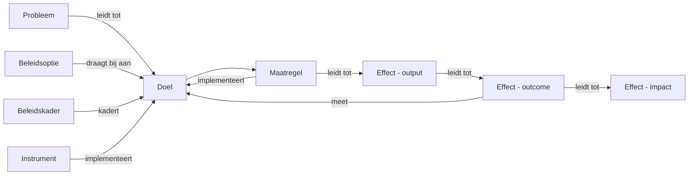

# Theoretische basis

Bouwmeester is een tool voor het beheren van beleidscorpussen. Het helpt beleidsmedewerkers bij het structureren van beleidsdossiers, doelen, instrumenten, maatregelen en hun onderlinge relaties in een gerichte graaf.

## Beleidstheorie en het Beleidskompas

Het Beleidskompas is het raamwerk van de Rijksoverheid voor het ontwikkelen en evalueren van beleid. Het beschrijft een **resultaatketen** die loopt van maatschappelijke problemen, via beleidsdoelen en interventies, naar meetbare effecten.

Bouwmeester maakt deze keten expliciet en navigeerbaar door elk onderdeel als een **node** in een graaf vast te leggen, met getypeerde relaties (**edges**) ertussen.

## ArchiMate Motivation Extension

Bureau Architectuur Digitale Overheid en beleidsmedewerkers beschrijven dezelfde causale keten maar in verschillende taalwerelden:

- **Architecten** gebruiken de ArchiMate Motivation Extension (Driver, Goal, Principle, Capability, etc.)
- **Beleidsmakers** gebruiken Beleidstheorie/Beleidskompas (Probleem, Doel, Beleidskader, Instrument, etc.)

Bouwmeester biedt een vocabulaire-toggle waarmee gebruikers kunnen wisselen tussen het beleidsjargon en het ArchiMate-jargon.

### Conceptmapping

| ArchiMate (Motivation) | Beleidstheorie | In Bouwmeester? | Bouwmeester node type |
|---|---|---|---|
| Driver | Probleem / Aanleiding | Ja | `probleem` |
| Assessment | Probleemanalyse (stap 1) | Nee | Metadata op `probleem` |
| Stakeholder | Doelgroep / Actor | Deels | `Person` + `NodeStakeholder` |
| Goal | Doel (strategisch/specifiek) | Ja | `doel` |
| Outcome | Effect (outcome/impact) | Ja | `effect` |
| Principle | Beleidsuitgangspunt / Beleidskader | Ja | `beleidskader` |
| Requirement | Randvoorwaarde / Vereiste | Nee | Alleen als edge type `vereist` |
| Constraint | Beperking / Kader | Nee | Kan samenvallen met randvoorwaarde |
| Value | Maatschappelijke waarde | Nee | Toekomstige uitbreiding |
| Meaning | Beleidstheorie | Nee | Metadata/beschrijving op dossier |
| Course of Action | Beleidsoptie | Ja | `beleidsoptie` |
| Capability | Instrument | Ja | `instrument` |
| Resource | Middelen (budget, fte) | Nee | Tekstveld `kosten_indicatie` op maatregel |

### Toelichting per concept

- **Driver / Probleem** - Het "waarom" dat alles aandrijft. In ArchiMate een externe of interne factor; in beleidstheorie het maatschappelijk probleem.
- **Goal / Doel** - Direct equivalent. ArchiMate onderscheidt niet expliciet tussen strategisch en operationeel, Bouwmeester wel via het `type` veld.
- **Outcome / Effect** - ArchiMate's Outcome beschrijft het resultaat van architectuurwerk. In beleidstheorie is dit de resultaatketen: output, outcome, impact.
- **Principle / Beleidskader** - ArchiMate-principes zijn richtinggevende uitspraken; beleidskaders vormen het juridisch en beleidsmatig kader.
- **Course of Action / Beleidsoptie** - Beide beschrijven een mogelijke aanpak voordat een keuze is gemaakt.
- **Capability / Instrument** - ArchiMate's Capability is het vermogen van de organisatie; een beleidsinstrument is het middel waarmee beleid wordt uitgevoerd.
- **Maatregel** - Geen direct ArchiMate-equivalent. Bouwmeester-specifiek als concrete uitvoeringsmaatregel, mapped naar `CourseOfAction` met status "gekozen" bij export.

### Edge type mapping naar ArchiMate

| Bouwmeester edge | ArchiMate relatie | Richting | Notities |
|---|---|---|---|
| `draagt_bij_aan` | Influence | source naar target | Positieve bijdrage |
| `implementeert` | Realization | source realizes target | Instrument/maatregel realiseert doel |
| `kadert` | Association / Composition | bidirectioneel | Beleidskader kadert doel/instrument |
| `vereist` | Serving / Access | source serves target | Randvoorwaarde |
| `conflicteert_met` | *(geen equivalent)* | bidirectioneel | Bouwmeester-specifiek |
| `vervangt` | *(geen equivalent)* | source naar target | Lifecycle management |
| `aanvulling_op` | Aggregation | source naar target | Deels |
| `leidt_tot` | Triggering | source triggers target | Causale keten |
| `adresseert` | Influence (negatief) | source naar target | Maatregel/instrument adresseert probleem |
| `meet` | Association | source naar target | Effect wordt gemeten aan indicator/doel |

**Ontbrekende ArchiMate-relaties:**

- **Composition** - Niet expliciet nodig; dossier fungeert als container.
- **Specialization** - Niet relevant voor het huidige model.
- **Flow** - Kan relevant worden bij procesmodellering (toekomstig).

## De resultaatketen

De kern van de beleidstheorie is de resultaatketen: de causale logica die een probleem via interventies verbindt aan meetbare effecten.

### Leeswijzer

1. Een **probleem** motiveert een beleidsdossier en leidt tot een **doel**
2. Verschillende **beleidsopties** dragen bij aan dat doel
3. Na keuze worden **maatregelen** gedefinieerd die het doel implementeren
4. Maatregelen produceren **output** (directe resultaten)
5. Output leidt tot **outcome** (gedragsverandering bij doelgroep)
6. Outcome resulteert in **impact** (maatschappelijk effect)
7. Effecten worden gemeten aan de hand van het oorspronkelijke **doel**

## Node types

Bouwmeester kent de volgende node types:

| Type | Beschrijving | Kleur |
|---|---|---|
| Dossier | Beleidsdossier dat gerelateerde items groepeert | Blauw |
| Doel | Beleidsdoel (strategisch of operationeel) | Groen |
| Instrument | Beleidsinstrument waarmee beleid wordt uitgevoerd | Paars |
| Beleidskader | Juridisch of beleidsmatig kader | Amber |
| Maatregel | Concrete uitvoeringsmaatregel | Cyaan |
| Probleem | Maatschappelijk probleem dat beleid motiveert | Rood |
| Effect | Verwacht of gemeten effect (output/outcome/impact) | Smaragd |
| Beleidsoptie | Mogelijke aanpak voordat een keuze is gemaakt | Indigo |
| Politieke Input | Parlementaire items (moties, kamervragen) | Roze |
| Bron | Brondocument (rapport, wetgeving, advies, etc.) | Oranje |
| Notitie | Vrije notitie | Leisteen |

## Edge types (relaties)

Relaties tussen nodes geven de causale en semantische verbanden weer:

| Relatie | Beschrijving | Voorbeeld |
|---|---|---|
| Draagt bij aan | Positieve bijdrage van bron aan doel | Instrument draagt bij aan doel |
| Implementeert | Bron realiseert het doel | Maatregel implementeert doel |
| Leidt tot | Causaal verband | Probleem leidt tot doel; maatregel leidt tot effect |
| Kadert | Beleidsmatige inkadering | Beleidskader kadert doel |
| Vereist | Randvoorwaarde | Instrument vereist maatregel |
| Adresseert | Bron adresseert een probleem | Maatregel adresseert probleem |
| Meet | Bron meet het doel | Effect meet doel |
| Conflicteert met | Tegenstrijdigheid | Doel conflicteert met ander doel |
| Vervangt | Lifecycle vervanging | Nieuwe maatregel vervangt oude |
| Aanvulling op | Complementair verband | Instrument is aanvulling op ander instrument |
| Onderdeel van | Hiërarchisch verband | Deeldoel is onderdeel van hoofddoel |
| Vloeit voort uit | Bron vloeit voort uit doel | Maatregel vloeit voort uit beleidskader |
| Verwijst naar | Referentie | Bron verwijst naar rapport |
| Evalueert | Evaluatieverband | Bron evalueert maatregel |

## Toekomstige uitbreidingen

Op basis van de ArchiMate mapping zijn de volgende uitbreidingen geprioriteerd:

| # | Concept | ArchiMate | Status | Rationale |
|---|---------|-----------|--------|-----------|
| 1 | `probleem` | Driver | Geimplementeerd | Het "waarom" dat alles verankert |
| 2 | `effect` | Outcome | Geimplementeerd | Sluit de resultaatketen |
| 3 | `beleidsoptie` | Course of Action | Geimplementeerd | Maakt vergelijking van alternatieven mogelijk |
| 4 | `randvoorwaarde` | Requirement/Constraint | Toekomstig | Legt beperkingen vast als eerste-klas objecten |
| 5 | `waarde` | Value | Toekomstig | Beschrijft de maatschappelijke waardepropositie |
| 6 | `doelgroep` | Stakeholder | Toekomstig | Doelpubliek als apart concept (nu via NodeStakeholder) |

Overige toekomstige mogelijkheden:

- **Resource-modellering** - Budget, fte, en andere middelen als eerste-klas objecten
- **Procesmodellering** - ArchiMate Business Layer integratie voor uitvoeringsprocessen
- **Meervoudige taxonomieen** - Ondersteuning voor TOGAF, NORA en andere raamwerken naast ArchiMate
